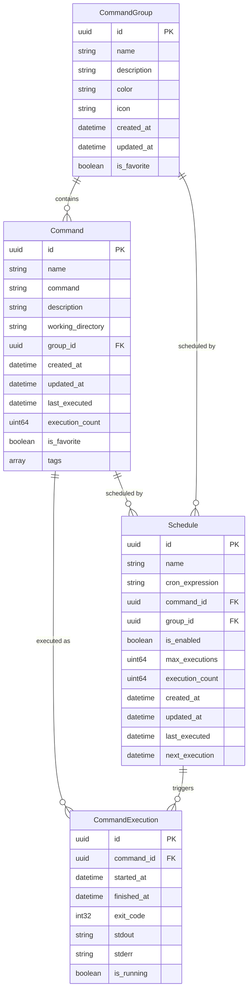

# Ordito Data Structures

*Last updated: August 23, 2025*  
*Version: 0.1.0*  
*Dependencies: Updated to latest versions*

This document provides a comprehensive overview of all data structures used in the Ordito application, including their purpose, relationships, and validation rules.

## Table of Contents

- [Core Entities](#core-entities)
  - [Command](#command)
  - [CommandGroup](#commandgroup)
  - [Schedule](#schedule)
  - [CommandExecution](#commandexecution)
- [Configuration](#configuration)
  - [AppConfig](#appconfig)
  - [AppSettings](#appsettings)
  - [AppConfiguration](#appconfiguration)
- [Request/Response Types](#requestresponse-types)
- [Enums](#enums)
- [Relationships](#relationships)
- [Validation Rules](#validation-rules)
- [Storage Format](#storage-format)

## Core Entities

### Command

Represents an individual command that can be executed by the system.

```rust
pub struct Command {
    pub id: Uuid,                                    // Unique identifier
    pub name: String,                                // Display name (required)
    pub description: Option<String>,                 // Optional description
    pub command: String,                             // Shell command to execute (required)
    pub working_directory: Option<String>,           // Working directory for execution
    pub environment_variables: Vec<EnvironmentVariable>, // Environment variables
    pub group_id: Option<Uuid>,                      // Reference to CommandGroup
    pub created_at: DateTime<Utc>,                   // Creation timestamp
    pub updated_at: DateTime<Utc>,                   // Last update timestamp
    pub last_executed: Option<DateTime<Utc>>,        // Last execution time
    pub execution_count: u64,                        // Number of times executed
    pub is_favorite: bool,                           // User favorite flag
    pub tags: Vec<String>,                           // Searchable tags
}
```

**Key Features:**
- Immutable UUID for unique identification
- Automatic timestamp management
- Execution tracking with count and last run time
- Optional grouping and tagging for organization
- Environment variable support for flexible execution

### CommandGroup

Logical grouping of related commands with visual customization.

```rust
pub struct CommandGroup {
    pub id: Uuid,                        // Unique identifier
    pub name: String,                    // Group name (required)
    pub description: Option<String>,     // Optional description
    pub color: Option<String>,           // Hex color code for UI (#RRGGBB)
    pub icon: Option<String>,            // Icon identifier/path
    pub created_at: DateTime<Utc>,       // Creation timestamp
    pub updated_at: DateTime<Utc>,       // Last update timestamp
    pub is_favorite: bool,               // User favorite flag
}
```

**Key Features:**
- Visual customization with colors and icons
- Hierarchical organization of commands
- Favorite marking for quick access

### Schedule

Cron-based scheduling configuration for automated command execution.

```rust
pub struct Schedule {
    pub id: Uuid,                            // Unique identifier
    pub name: String,                        // Schedule name (required)
    pub description: Option<String>,         // Optional description
    pub cron_expression: String,             // Cron expression (required, validated)
    pub command_id: Option<Uuid>,            // Single command to execute
    pub group_id: Option<Uuid>,              // Command group to execute
    pub is_enabled: bool,                    // Enable/disable flag
    pub max_executions: Option<u64>,         // Maximum number of executions
    pub execution_count: u64,                // Current execution count
    pub created_at: DateTime<Utc>,           // Creation timestamp
    pub updated_at: DateTime<Utc>,           // Last update timestamp
    pub last_executed: Option<DateTime<Utc>>, // Last execution time
    pub next_execution: Option<DateTime<Utc>>, // Calculated next execution time
}
```

**Key Features:**
- Standard cron expression support (validated)
- Can target either a single command or entire group
- Execution limiting with max_executions
- Automatic next execution calculation
- Enable/disable without deletion

### CommandExecution

Real-time tracking of command execution with output capture.

```rust
pub struct CommandExecution {
    pub id: Uuid,                        // Unique identifier
    pub command_id: Uuid,                // Reference to executed command
    pub started_at: DateTime<Utc>,       // Execution start time
    pub finished_at: Option<DateTime<Utc>>, // Execution end time
    pub exit_code: Option<i32>,          // Process exit code
    pub stdout: String,                  // Standard output capture
    pub stderr: String,                  // Standard error capture
    pub is_running: bool,                // Current execution status
}
```

**Key Features:**
- Complete execution lifecycle tracking
- Output capture for debugging and monitoring
- Process exit code for success/failure determination

## Configuration

### AppConfig

Main application configuration containing all user data.

```rust
pub struct AppConfig {
    pub commands: Vec<Command>,          // All user commands
    pub groups: Vec<CommandGroup>,       // All command groups
    pub schedules: Vec<Schedule>,        // All schedules
    pub settings: AppSettings,           // Application settings
    pub version: String,                 // Configuration version
    pub created_at: DateTime<Utc>,       // Creation timestamp
    pub updated_at: DateTime<Utc>,       // Last update timestamp
}
```

### AppSettings

User preferences and application behavior settings.

```rust
pub struct AppSettings {
    pub auto_start: bool,                // Start with system
    pub minimize_to_tray: bool,          // Minimize behavior
    pub show_notifications: bool,        // Notification preferences
    pub theme: Theme,                    // UI theme preference
    pub log_level: LogLevel,             // Logging verbosity
}
```

### AppConfiguration

Extended application configuration including UI and system preferences.

```rust
pub struct AppConfiguration {
    pub settings: AppSettings,           // Core app settings
    pub window: WindowConfig,            // Window configuration
    pub tray: TrayConfig,                // System tray configuration
    pub notifications: NotificationConfig, // Notification settings
}
```

#### WindowConfig

```rust
pub struct WindowConfig {
    pub width: u32,                      // Window width (default: 1200)
    pub height: u32,                     // Window height (default: 800)
    pub min_width: u32,                  // Minimum width (default: 800)
    pub min_height: u32,                 // Minimum height (default: 600)
    pub resizable: bool,                 // Allow resizing
    pub maximizable: bool,               // Allow maximizing
    pub minimizable: bool,               // Allow minimizing
    pub closable: bool,                  // Allow closing
    pub always_on_top: bool,             // Always on top flag
    pub skip_taskbar: bool,              // Hide from taskbar
}
```

#### TrayConfig

```rust
pub struct TrayConfig {
    pub enabled: bool,                   // Enable system tray
    pub show_menu_on_left_click: bool,   // Left click behavior
    pub double_click_action: TrayAction, // Double click action
    pub close_to_tray: bool,             // Close to tray behavior
}
```

#### NotificationConfig

```rust
pub struct NotificationConfig {
    pub enabled: bool,                   // Enable notifications
    pub show_execution_complete: bool,   // Notify on completion
    pub show_execution_failed: bool,     // Notify on failure
    pub show_schedule_executed: bool,    // Notify on scheduled execution
    pub sound_enabled: bool,             // Enable notification sounds
}
```

## Request/Response Types

### Command Operations

```rust
pub struct CreateCommandRequest {
    pub name: String,
    pub description: Option<String>,
    pub command: String,
    pub working_directory: Option<String>,
    pub environment_variables: Vec<EnvironmentVariable>,
    pub group_id: Option<Uuid>,
    pub tags: Vec<String>,
}

pub struct UpdateCommandRequest {
    pub id: Uuid,
    pub name: Option<String>,
    pub description: Option<String>,
    pub command: Option<String>,
    pub working_directory: Option<String>,
    pub environment_variables: Option<Vec<EnvironmentVariable>>,
    pub group_id: Option<Uuid>,
    pub is_favorite: Option<bool>,
    pub tags: Option<Vec<String>>,
}
```

### Group Operations

```rust
pub struct CreateGroupRequest {
    pub name: String,
    pub description: Option<String>,
    pub color: Option<String>,
    pub icon: Option<String>,
}

pub struct UpdateGroupRequest {
    pub id: Uuid,
    pub name: Option<String>,
    pub description: Option<String>,
    pub color: Option<String>,
    pub icon: Option<String>,
    pub is_favorite: Option<bool>,
}
```

### Schedule Operations

```rust
pub struct CreateScheduleRequest {
    pub name: String,
    pub description: Option<String>,
    pub cron_expression: String,
    pub command_id: Option<Uuid>,
    pub group_id: Option<Uuid>,
    pub max_executions: Option<u64>,
}

pub struct UpdateScheduleRequest {
    pub id: Uuid,
    pub name: Option<String>,
    pub description: Option<String>,
    pub cron_expression: Option<String>,
    pub command_id: Option<Uuid>,
    pub group_id: Option<Uuid>,
    pub is_enabled: Option<bool>,
    pub max_executions: Option<u64>,
}
```

### Supporting Types

```rust
pub struct EnvironmentVariable {
    pub key: String,                     // Environment variable name
    pub value: String,                   // Environment variable value
}
```

## Enums

### Theme

```rust
pub enum Theme {
    Light,                               // Light theme
    Dark,                                // Dark theme
    System,                              // Follow system theme
}
```

### LogLevel

```rust
pub enum LogLevel {
    Error,                               // Error messages only
    Warn,                                // Warnings and errors
    Info,                                // General information
    Debug,                               // Debug information
    Trace,                               // Verbose tracing
}
```

### TrayAction

```rust
pub enum TrayAction {
    ShowWindow,                          // Show application window
    HideWindow,                          // Hide application window
    ToggleWindow,                        // Toggle window visibility
    DoNothing,                           // No action
}
```

## Relationships

### Entity Relationships



### Key Constraints

1. **Schedule Targets**: A schedule must reference either a `command_id` OR a `group_id`, but not both
2. **Command Groups**: Commands can optionally belong to a group via `group_id`
3. **Unique Names**: Command names must be unique within the application
4. **Group Names**: Group names must be unique within the application
5. **Schedule Names**: Schedule names must be unique within the application

## Validation Rules

### Command Validation

- `name`: Required, non-empty, trimmed, unique
- `command`: Required, non-empty, trimmed
- `working_directory`: Optional, must be valid path if provided
- `environment_variables`: Each key must be valid identifier
- `tags`: Each tag must be non-empty, trimmed

### CommandGroup Validation

- `name`: Required, non-empty, trimmed, unique
- `color`: Optional, must be valid hex color (#RRGGBB) if provided
- `icon`: Optional, must be valid icon identifier/path if provided

### Schedule Validation

- `name`: Required, non-empty, trimmed, unique
- `cron_expression`: Required, must be valid cron syntax (validated with cron crate)
- `command_id` XOR `group_id`: Exactly one must be provided
- `max_executions`: Optional, must be > 0 if provided

### Cron Expression Format

Ordito uses standard 5-field cron expressions:
```
* * * * *
│ │ │ │ │
│ │ │ │ └── Day of week (0-7, Sunday = 0 or 7)
│ │ │ └──── Month (1-12)
│ │ └────── Day of month (1-31)
│ └──────── Hour (0-23)
└────────── Minute (0-59)
```

**Examples:**
- `0 0 * * *` - Daily at midnight
- `*/5 * * * *` - Every 5 minutes
- `0 9 * * 1-5` - Weekdays at 9 AM
- `0 0 1 * *` - Monthly on the 1st

## Storage Format

### File Locations

- **Configuration**: `{APP_DATA}/config.json`
- **App Settings**: `{CONFIG_DIR}/app_config.json`
- **Logs**: `{APP_DATA}/logs/`
- **Backups**: `{APP_DATA}/config.backup.{timestamp}.json`

### JSON Schema

The configuration is stored as JSON with the following structure:

```json
{
  "commands": [
    {
      "id": "550e8400-e29b-41d4-a716-446655440000",
      "name": "Hello World",
      "description": "Simple greeting command",
      "command": "echo 'Hello, World!'",
      "working_directory": null,
      "environment_variables": [
        {
          "key": "GREETING",
          "value": "Hello"
        }
      ],
      "group_id": "550e8400-e29b-41d4-a716-446655440001",
      "created_at": "2025-08-23T10:00:00Z",
      "updated_at": "2025-08-23T10:00:00Z",
      "last_executed": "2025-08-23T11:30:00Z",
      "execution_count": 5,
      "is_favorite": true,
      "tags": ["greeting", "test"]
    }
  ],
  "groups": [
    {
      "id": "550e8400-e29b-41d4-a716-446655440001",
      "name": "Development Tools",
      "description": "Commands for development workflow",
      "color": "#3498db",
      "icon": "code",
      "created_at": "2025-08-23T10:00:00Z",
      "updated_at": "2025-08-23T10:00:00Z",
      "is_favorite": false
    }
  ],
  "schedules": [
    {
      "id": "550e8400-e29b-41d4-a716-446655440002",
      "name": "Daily Backup",
      "description": "Run backup every day at midnight",
      "cron_expression": "0 0 * * *",
      "command_id": "550e8400-e29b-41d4-a716-446655440000",
      "group_id": null,
      "is_enabled": true,
      "max_executions": null,
      "execution_count": 10,
      "created_at": "2025-08-23T10:00:00Z",
      "updated_at": "2025-08-23T10:00:00Z",
      "last_executed": "2025-08-23T00:00:00Z",
      "next_execution": "2025-08-24T00:00:00Z"
    }
  ],
  "settings": {
    "auto_start": false,
    "minimize_to_tray": true,
    "show_notifications": true,
    "theme": "System",
    "log_level": "Info"
  },
  "version": "0.1.0",
  "created_at": "2025-08-23T10:00:00Z",
  "updated_at": "2025-08-23T12:00:00Z"
}
```

### Migration Strategy

- Version field tracks configuration schema version
- Automatic migration on application startup
- Backup creation before migration
- Graceful fallback to defaults for invalid data

---

*This document is automatically maintained and reflects the current implementation in `/src-tauri/src/models.rs`*